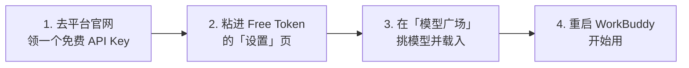

<div align="center">


# Free Token

**让你的 WorkBuddy 免费换上大牌 AI 模型**

不用花钱、不用看文档、不用懂技术 —— 点几下鼠标就配好了。


</div>

---

## 🤔 这是什么？解决了什么问题？

**先说个背景：** WorkBuddy 可以接入外部的 AI 模型（比如 DeepSeek、Qwen、GLM、GPT 这些）。但如果要自己接，你得：找到平台官网 → 注册账号 → 研究怎么申请 API Key → 找到配置文件 → 手抄一堆看不懂的地址和参数……一步错就全白干。

**Free Token 就是来干这件事的。** 它把上面这一整套流程变成了：**挑模型 → 点一下 → 重启 WorkBuddy**。

打开它，你能看到 4 个平台的免费模型整整齐齐摆在一起，哪个免费、哪个好用一目了然。

---

## 📖 先看懂这 4 个词（30 秒）

不然后面看不懂。

| 你会看到的词 | 其实就是 | 打个比方 |
| --- | --- | --- |
| **API Key** | 平台给你的一串密码，证明"这个账号是我" | 🎫 游乐园的**门票**，凭票入场 |
| **模型** | 具体干活的那个 AI，比如 DeepSeek、Qwen | 🎢 园里的**具体项目** |
| **载入到 WorkBuddy** | 把这个模型登记到 WorkBuddy 的名单里 | 📝 在**报名表**上把你的名字写上 |
| **重启 WorkBuddy** | 完全关掉再打开 | 🔄 名单只在开门时读一次，得重新开门 |

> 💡 **记住一句话就够**：免费 Key 去平台官网领，领回来粘进 Free Token，剩下的它帮你干。

---

## 📥 第一步：装上它

### 去哪儿下载

打开 [**Releases 页面**](https://github.com/walter-io/workbuddy-free-token-manage/releases)，找到最新的版本，按你的电脑选一个下载：

| 你的电脑 | 下载这个文件 |
| --- | --- |
| 🪟 **Windows** | `Free-Token-x.x.x-win-x64.exe` |
| 🍎 **Mac（M1/M2/M3/M4 芯片）** | `Free-Token-x.x.x-mac-arm64.dmg` |
| 🍎 **Mac（Intel 芯片）** | `Free-Token-x.x.x-mac-x64.dmg` |

> **Mac 用户不知道自己是哪种芯片？**
> 点屏幕左上角 苹果图标 → 「关于本机」→ 看「芯片」那一行：写着 **Apple M1/M2/M3/M4** 就下 **arm64**；写着 **Intel** 就下 **x64**。

### ⚠️ 安装时会遇到的两个弹窗（正常现象，不是病毒）

> 因为作者没钱买苹果和微软的「开发者签名证书」（一年要几百上千块），系统会例行公事地警告一下。**点掉就行。**

<details>
<summary><b>🪟 Windows 提示「Windows 已保护你的电脑」</b></summary>

点小字 **「更多信息」** → 再点 **「仍要运行」**，就装上了。

</details>

<details>
<summary><b>🍎 Mac 提示「无法验证开发者」/「已损坏」</b></summary>

**方法一（推荐）**：打开「访达」→ 左侧「应用程序」→ **右键点 Free Token → 选「打开」** → 弹窗里再点一次 **「打开」**。之后就不拦了。

**方法二**：如果还是打不开，打开「终端」App，粘这一行回车：

```bash
xattr -cr /Applications/Free\ Token.app
```

> ⚠️ 注意 `Free\ Token` 中间那个反斜杠不能删，它代表空格。

</details>

### 还有一个前提

Free Token 是给 WorkBuddy 用的，所以你得**先装好 WorkBuddy，并且至少打开过一次**。
（软件会自动找到 WorkBuddy 装在哪，一般不用你操心。万一找不到，见文末「WorkBuddy 装在奇怪的位置怎么办」。）

---

## 🚀 第二步：配置好，开始用（照着点，共 4 步）



### ① 领一个免费的 API Key（约 2 分钟）

推荐从 **OpenRouter** 开始——**一个 Key 就能用几十个免费模型**，最省事。

1. 打开 👉 [openrouter.ai/settings/keys](https://openrouter.ai/settings/keys)
2. 用**邮箱**或 **GitHub 账号**注册登录（免费，不用绑卡）
3. 点 **「Create Key」**，复制那串 `sk-or-v1-...` 开头的长文本

> 复制完先粘到记事本存一下，这个弹窗关掉后就看不到了。
>
> 其他平台流程一模一样（注册 → 找 API Keys → 新建 → 复制）。Free Token 的「设置」页里，每个平台旁边都有**直达链接**，不用自己搜。

### ② 把 Key 粘进 Free Token

1. 打开 Free Token，点左侧 **「设置」**
2. 点 **「添加到平台」**，选 **OpenRouter**
3. 把刚才那串 Key 粘进去 → 点 **「验证并添加」**

看到 ✅ 就成功了。如果报错，多半是复制时**首尾漏了字符或多带了空格**，重新复制一次。

### ③ 挑模型，一键载入

1. 点左侧 **「模型广场」**
2. 顶部平台选 **OpenRouter**（默认就是它）
3. 筛选栏点 **「免费」**——这一步很关键，不然会混进要收费的模型
4. **点整行任意位置**就能勾选模型（不用非得点那个小方框），可以多选
5. 点右下角 **「载入到 WorkBuddy」**

### ④ 重启 WorkBuddy

WorkBuddy **只在启动时**读取一次模型名单。所以载入完，会弹出一个提示框，直接点里面的 **「马上重启 WorkBuddy」** 就行。

🎉 **搞定！** 打开 WorkBuddy 的自定义模型列表，刚才选的模型已经躺在里面了。

---

## 🆓 能用的免费平台（4 个）

> 只收录**国内网络能直接用**的平台，所以只有 4 个。

| 平台 | 免费力度 | 要不要 Key | 适合谁 |
| --- | --- | --- | --- |
| [**OpenRouter**](https://openrouter.ai) ⭐ | 几十个 `:free` 模型，每天 50 次 | 要 | **新手首选**，一个 Key 通吃 |
| [**硅基流动**](https://siliconflow.cn) | 部分小模型**永久免费**，国内直连快 | 要 | 想要速度快、不折腾网络 |
| [**魔搭 ModelScope**](https://modelscope.cn) | 每个模型**每天 2000 次** | 要 | 用量大（需先绑定阿里云账号） |
| [**Agnes AI**](https://www.agnes-ai.com) | 推广期文本/图像/视频全免费 | 要 | 想试多模态 |

> 💡 **真的不用全注册。** 只弄一个 OpenRouter 就够日常用了。等觉得不够，再按需加。
>
> ⚠️ 各平台免费政策随时可能调整，以官网为准。

### 界面上还有 5 个灰掉的平台，点不动？

这是**故意的**，不是 bug。它们在国内环境下用不了：

| 平台 | 灰掉的原因 | 点击时提示 |
| --- | --- | --- |
| Groq、Google AI Studio、NVIDIA NIM、GitHub Models | 国内网络直连会被拒（需全局代理） | 地区受限暂无法使用 |
| OpenCode Zen | 平台本身不允许外部客户端调用 | 平台限制无法在外部使用 |

技术上程序里保留了对它们的识别能力，所以你**以前如果载入过**这些平台的模型，仍然可以在「模型广场」的「已载入」面板里正常移除。

---

## ❓ 新手最容易问的问题

<details>
<summary><b>要花钱吗？会不会偷偷扣我钱？</b></summary>

**不会。** 两点说明：

1. 这个工具本身开源免费，作者不收你一分钱。
2. 上面 4 个平台都提供**免费档**，不绑银行卡也能用（个别平台要绑手机号或阿里云账号做实名）。

工具**只会调用免费额度的接口**，没有任何替你付费的能力。只要你**不主动**去平台官网充值，就永远不产生费用。

</details>

<details>
<summary><b>每天能免费用多少次？</b></summary>

以最常用的 OpenRouter 为例：免费模型**每分钟 20 次、每天 50 次**，每天早上 8 点重置。

（小知识：如果你在 OpenRouter 账号里累计充过 $10，上限会自动提到每天 1000 次——**但这需要你主动充**，不充就是 50 次。）

Free Token 左侧的 **「额度与积分」** 页会实时显示今天还剩多少次（其他平台视其是否提供额度接口而定，没接口的会标注「无额度接口」）。各平台限额见官网说明。

</details>

<details>
<summary><b>我的 Key 安全吗？会不会被传到别人服务器？</b></summary>

**安全，完全不外传。** 具体地说：

- Key 只存在**你自己电脑**的一个文件里（`~/.free-token/config.json`），不上传任何地方
- 只有在你点击查询/使用某个平台时，才会直连**那个平台自己的官方接口**
- 工具没有云端服务器，也没有账号系统，作者看不到任何东西
- 网络端口只监听本机（`127.0.0.1`），**同一个 WiFi 下的别人也访问不到**

</details>

<details>
<summary><b>载入了，但 WorkBuddy 里看不到新模型？</b></summary>

99% 是因为**没重启 WorkBuddy**。它只在启动时读一次模型名单。

把 WorkBuddy **完全退出**（不是最小化，是关掉）再打开。模型广场的弹窗里有「马上重启 WorkBuddy」按钮，点它最省事。

</details>

<details>
<summary><b>为什么有些模型是灰的、点不动？</b></summary>

两种情况，原因不一样：

1. **整个平台是灰的** → 见上面「界面上还有 5 个灰掉的平台」，是地区或平台限制。
2. **某个模型单独是灰的** → 这个模型**不是给聊天用的**。比如画图的、做语音识别的、算 embedding 的，WorkBuddy 的自定义模型只接受**文本对话模型**，所以标灰并显示"不支持载入"。同平台其他聊天模型不受影响。

</details>

<details>
<summary><b>图像、视频生成模型能用吗？</b></summary>

可以**浏览和查看**，但**不能载入到 WorkBuddy**——因为 WorkBuddy 的自定义模型是给文字对话用的。表格里这类模型会显示"不支持载入"。

</details>

<details>
<summary><b>想换模型 / 不想用了，怎么删掉？</b></summary>

在「模型广场」找到那个模型，点右边的 **「移除」**。

放心两点：
- 移除前工具会**自动备份** WorkBuddy 的配置文件，万一出错能回滚
- **只会删掉本工具载入的条目**，你自己手动配置的其他模型一根汗毛都不会动

</details>

<details>
<summary><b>提示"Key 无效"怎么办？</b></summary>

按这个顺序排查：

1. **复制不完整**（最常见）——重新复制一次，注意别漏掉开头结尾
2. **多了空格**——粘贴后检查首尾有没有多余空格或换行
3. **平台侧问题**——比如魔搭会提示 `Please bind your Alibaba Cloud account before use.`，意思是**你要先去阿里云绑定账号**，Key 本身没问题
4. **网络问题**——提示 `fetch failed` 或超时，多半是网络连不上该平台，看下一条

</details>

<details>
<summary><b>连不上平台 / 一直转圈怎么办？</b></summary>

海外平台（比如 OpenRouter）在国内可能连不上。去「**设置 → 网络代理**」，填上你的代理地址即可。

留空的话，工具会自动尝试读系统代理和环境变量，都没有就直连。

</details>

<details>
<summary><b>WorkBuddy 装在奇怪的位置，找不到怎么办？</b></summary>

去「**设置 → WorkBuddy 数据目录**」：

1. 先点 **「重新检测」**（绝大多数情况到这就好了）
2. 还不行就展开「手动指定」，把 WorkBuddy 的数据目录路径填进去

</details>

<details>
<summary><b>WorkBuddy 显示"未运行"，但我明明开着？</b></summary>

可能只是**检测不到**（比如系统安全策略不允许程序调用命令行），不代表真的没开。

界面上会区分三种状态：**运行中**（绿）、**未运行**（灰）、**状态未知**（黄，鼠标悬停能看到原因）。

显示"状态未知"时，载入模型照样能成功，只是需要你**手动重启 WorkBuddy** 让它生效。

</details>

---

## 🔒 数据与隐私（一句话版）

**所有数据都只在你自己的电脑上，作者碰不到。**

- Key、统计结果只存本机 `~/.free-token/`，没有云端服务器
- Token 统计是**本地**读取 WorkBuddy 的会话日志算出来的
- 修改 WorkBuddy 配置前**自动备份**，万一写坏会**自动回滚**
- 「移除」只动本工具载入的条目，你手工加的配置永不触碰

---

## 🛠️ 以下是开发者内容

> 👋 **普通用户到这里就可以关掉页面了，下面的内容跟使用无关。**

<details>
<summary><b>从源码运行</b></summary>

```bash
git clone https://github.com/walter-io/workbuddy-free-token-manage.git
cd free-token
npm install
npm run build

npm start        # Web 版：浏览器打开 http://127.0.0.1:57891
npm run app      # 桌面版：弹出应用窗口
```

开发模式（前端热更新）：

```bash
npm run dev:server   # 终端 1：API 服务
npm run dev          # 终端 2：Vite 开发服务器（http://localhost:5174）
```

</details>

<details>
<summary><b>技术栈</b></summary>

Node.js ≥18 · Electron 44 · Express 4 · Vite 6 · React 18 · TypeScript · Tailwind CSS v4 · Recharts

桌面版由 Electron 壳把 Express 服务跑在主进程内，**用户机器无需安装 Node**；端口被占用自动顺延、单实例锁、外链交由系统浏览器打开。

</details>

<details>
<summary><b>新增一个平台（约 30 行代码）</b></summary>

绝大多数平台都是 OpenAI 兼容接口，在 `server/providers/` 新建文件：

```js
import { defineOpenAIPlatform } from './genericOpenAI.mjs';

export const platform = defineOpenAIPlatform({
  id: 'xxx',
  name: 'XXX 平台',
  baseUrl: 'https://api.xxx.com/v1',
  modelsPublic: false,               // 模型列表是否免鉴权
  isFree: (m) => /free/.test(m.id),  // 或直接 true / false
  loadable: (m) => true,             // 协议不兼容时返回 false
  keyFormat: /^xxx_/,
  site: 'https://xxx.com',           // 官网（设置页直达链接）
  keyUrl: 'https://xxx.com/keys',    // Key 管理页
  note: '界面展示的注意事项',
});
```

再到 `server/providers/registry.mjs` 里 import 并加入 `PLATFORM_ORDER`，前端会自动出现新平台。

</details>

<details>
<summary><b>打包与发版</b></summary>

```bash
npm run app:dir    # 免安装目录 → release/win-unpacked
npm run app:win    # Windows 安装包 → release/*.exe
npm run app:mac    # macOS 镜像（必须在 macOS 上执行）
```

macOS 包无法在 Windows 上构建，因此走 CI：推代码后打个 tag 即会自动双平台构建并挂到 Release。

```bash
npm version patch --no-git-tag-version   # 改版本号（同步 package-lock）
git add -A && git commit -m "chore: release x.y.z"
git push
git tag -a vX.Y.Z -m "vX.Y.Z" && git push origin vX.Y.Z
```

[Release 工作流](.github/workflows/release.yml) 会在 Windows / macOS 上分别构建并创建 Release。

> ⚠️ 构建命令必须带 `--publish never`（workflow 里已加）：electron-builder 在 CI 中构建 tag 时，若不显式指定 `--publish`，会把发布策略**隐式推断为 `onTag`** 并自行发布，而该步骤没有 `GH_TOKEN` 会直接报错，导致打包完成后整个构建失败。

</details>

<details>
<summary><b>调研储备：下一批候选平台</b></summary>

- **Cloudflare Workers AI**：免费 neurons 额度，边缘推理
- **阿里云百炼**：每模型 100 万 tokens 免费且永久有效
- **火山方舟（豆包）**：每日 200 万 tokens（当前最高日额度）
- **腾讯混元**：hunyuan-lite 免费，100 万 tokens/年
- **百度千帆**：ERNIE Speed/Lite 等免费
- **Together AI**：少数模型永久免费
- **OVHcloud / Scaleway**：欧洲厂商，beta 期免费
- **Cohere**：trial key 免费限速
- **Pollinations**：完全无 Key（稳定性一般）

参考：[腾讯云 2026 免费 API 汇总](https://developer.cloud.tencent.com/article/2626756) · [ai-bot.cn 免费 Token 指南](https://ai-bot.cn/free-token-api/) · [SiliconFlow 更新公告](https://docs.siliconflow.cn/cn/release-notes/overview)

</details>

---

## License

[MIT](LICENSE) © Free Token contributors
